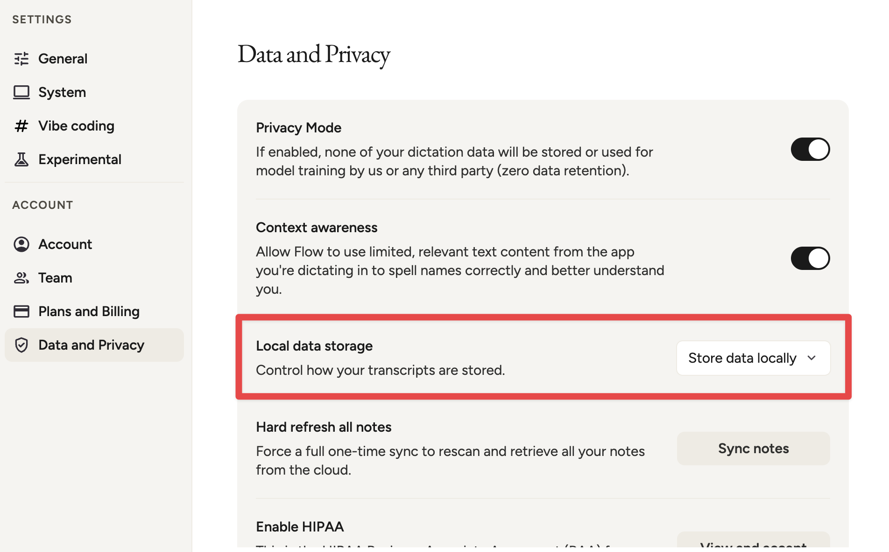

# WisprSync

WisprSync exports your local Wispr Flow transcript data into a folder you control.

It is built for people who want direct access to their own transcript history, audio files, metadata, and indexes without manually exporting one item at a time.

## Unofficial Project

WisprSync is an independent, unofficial project. 

It is not affiliated with, endorsed by, sponsored by, or supported by Wispr AI, Inc. or Wispr Flow.

`Wispr` and `Wispr Flow` are trademarks or product names of their respective owners. They are used here only to identify the application whose local data this tool helps a user export from their own machine.

Use it at your own risk.

It reads local application data from your machine, and the exported data can contain sensitive transcripts, app context, URLs, screenshots, and audio.

## Why This Exists

Wispr Flow has a per-transcript export path, but no simple full data export workflow.

WisprSync makes that local data visible and portable by writing it into a documented folder structure with records, metadata, text files, media files, indexes, a manifest, and run reports.

The goal is data ownership

If the data is on your machine, you should be able to inspect it, back it up, analyze it, and move it into whatever workflow you prefer.

The longer project backstory is in [docs/00-foundation/10-backstory.md](docs/00-foundation/10-backstory.md).

## Export Modes

WisprSync writes to a folder you specify.

The easiest sync setup is to choose a folder already handled by Dropbox, iCloud Drive, Google Drive, OneDrive, or a similar file sync tool.

## Prerequisite

WisprSync depends on Wispr Flow storing transcript data locally.

In Wispr Flow, go to `Settings > Data and Privacy > Local data storage` and choose `Store data locally`.

If local data storage is disabled, WisprSync will not have local transcript data to export.



## Quick Start

The preferred setup path is to open this repository with Codex and ask it to use the local WisprSync skill:

```text
Use the WisprSync skill to set this repository up on my computer, then run an initial sync and summarize the manifest counts.
```

The skill guides Codex through the machine-local steps: confirm this repo root, discover the Wispr Flow SQLite database, choose the export folder, write `.wisprsync/config.json`, run `./bin/sync`, validate the export, and summarize the latest run. This is preferred because the correct source database and output folder are local to each computer.

From the repo root:

```sh
./bin/setup
./bin/sync
```

Setup is assisted and confirm-before-write. 

- Shows the repo root and config path
- Lists discovered Wispr Flow databases with `History` row counts
- Asks for the source and export directory
- Displays the resolved destination
- Then shows a final review before writing `.wisprsync/config.json`.

The suggested folder is `../wispr_sync`, but you can choose any safe folder,
including one already handled by iCloud Drive, Dropbox, Google Drive, or another
sync tool.

Useful internal commands:

```sh
python3 -m wisprsync setup
python3 -m wisprsync sync
python3 -m wisprsync export
python3 -m wisprsync validate
python3 -m wisprsync schedule install
python3 -m wisprsync doctor
```

Local machine config is written to:

```text
.wisprsync/config.json
```

That file should stay local and ignored by Git.

## Output

WisprSync writes to the folder selected during setup. The recommended default
folder name is `wispr_sync`.

```text
wispr_sync/
├── manifest.json
├── indexes/
│   ├── history.jsonl
│   ├── dictionary.jsonl
│   └── runs.jsonl
├── records/
│   └── YYYY/MM/DD/{timestamp}_{transcriptEntityId}/
│       ├── metadata.json
│       ├── raw_transcript.txt
│       ├── formatted_transcript.txt
│       ├── audio.wav
│       └── screenshot.png
└── runs/
    └── YYYY/MM/DD/{run_id}.json
```

Files are omitted when the source row does not contain the corresponding value.

## Safety Notes

- Do not commit raw Wispr Flow app folders, cookies, sessions, caches, or SQLite source snapshots.
- Do not commit `.wisprsync/config.json`.
- WisprSync blocks unsafe output paths by default, including paths inside the
  source database directory, Wispr Flow app data, the repo root, or private
  `.wisprsync` state. Interactive setup allows repo-local output only after a
  warning and explicit confirmation; `.wisprsync/` and `.wisprsync-cache/`
  remain blocked.
- Noninteractive setup requires `--output`. `--yes` does not infer an output
  folder. Use `--allow-unsafe-output` only for intentional scripted developer
  workflows.
- Be careful publishing the export folder; it may contain private transcripts, URLs, screenshots, and audio.
- Prefer a private cloud-synced folder for personal exports.

## Future Extensions

WisprSync does not currently commit, push, upload, or call webhooks. A future
extension system could run user-defined actions after a successful folder sync,
such as pushing to GitHub or calling a local automation script, but that is not
part of the supported implementation today.

## Documentation

Start at [docs/00-overview.md](docs/00-overview.md).

Key docs:

- [Backstory](docs/00-foundation/10-backstory.md)
- [Wispr Flow Source Shape](docs/10-system-design/10-data-structure/10-wispr-flow-source-shape.md)
- [WisprSync Output Shape](docs/10-system-design/10-data-structure/20-wisprsync-output-shape.md)
- [Folder Export](docs/10-system-design/20-exporting/10-folder-export.md)
- [Setup Workflow](docs/20-implementation/99-appendix/10-setup-workflow.md)

## License

WisprSync is released under the [MIT License](LICENSE).
